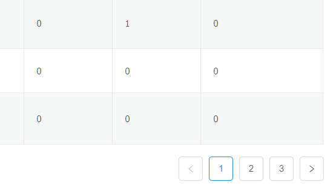
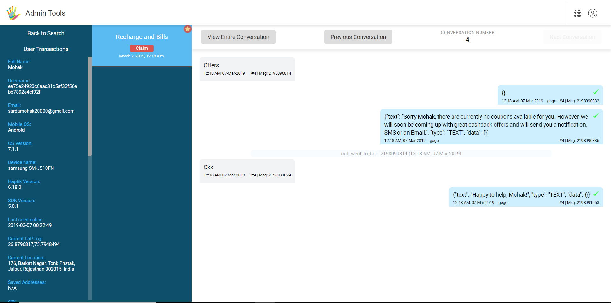
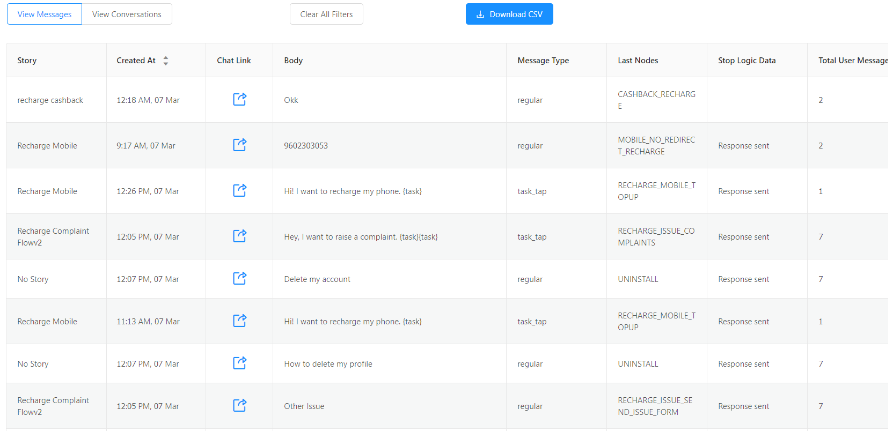
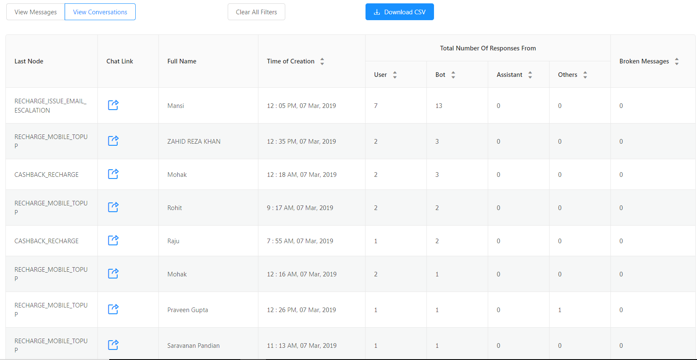
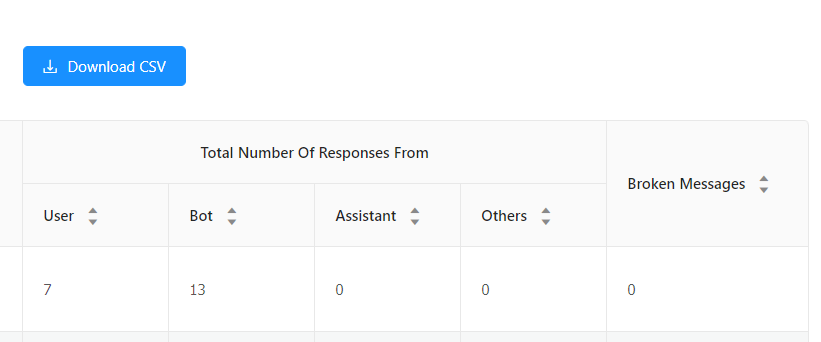
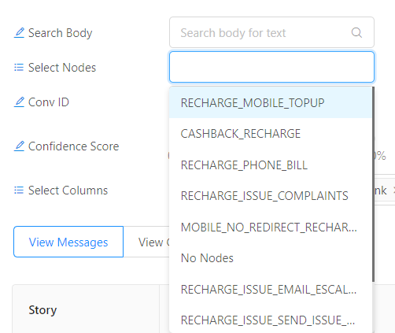
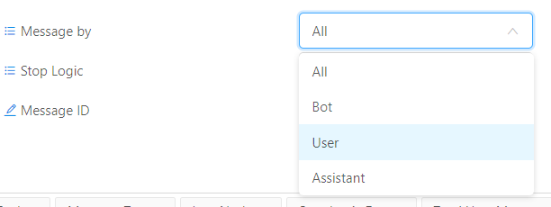
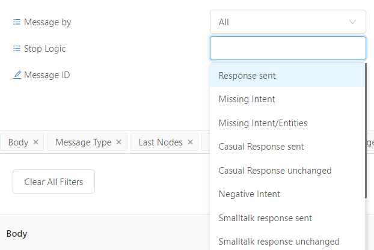
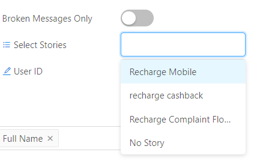

In the analytics tool you can go to the "*Message Analysis*" section to analyse the bot performance at a message level.

You can start by selecting a specific channel or bot and setting the time period. And then you should see a page with options to filter and analyse the messages sent and received by your bot.

The top half of the page consists of multiple filters. We will go through each of these filters and understand how they can be used later in this document. 

Below the filters you have a table of data where you can see the messages processed by clicking on the `View Messages` link. Or you can choose to see the conversations of your bot by clicking on the `View Conversations` link.

> Tip: A conversation is a set of messages processed to perform a task.

The data in the tables are paginated and you can scroll to different pages of the table by using the navigation icons below the table.

## View Messages
The View Messages section of the page which can be accessed by clicking on the `View Messages` link above the table. The table shows data about the messages processed by your bot.

The columns of the table can be configured by you in case of Viewing Messages. We will discuss these configurations in a later [section](#select-columns). But by default the tool selects a few columns for you. 

These columns are:
* **Story** - The `Story` in the bot builder that the message belongs to. A `Story` is a subcomponent within a bot.
* **Created At** - This column tells you when the message was recieved by the bot.
* **Chat Link** - This column provides a link to open and view the conversation related to the message. Clicking on the link will open a page that shows the conversation as well as the user details.  
  
* **Body** - This column shows you the actual message that was sent.
* **Message Type** - This column shows you how the message was sent. A message can be sent in two ways. One is the regular way, which is the user typing or clicking on a special chat element. The second is by tapping a task button from the taskbox.
* **Last Nodes** - This column shows the last node that the user was on before sending this message. This information can be useful to understand what the context was for the user sending the current message.
* **Stop Logic Data** - This column shows you what the reason was for the conversation flow to stop at this point. This reason could be one of the following:
    1) Response Sent
    2) Missing Intent
    3) Missing Intent/Entities
    4) Casual Response sent
    5) Casual Response unchanged
    6) Negative Intent
    7) Smalltalk Response Sent
    8) Smalltalk Response Unchanged
    9) Error
    10) Outlier Response
    11) Retry Ideal Flow
* **Total User Messages** - This column shows the total number of messages in the conversation to which the message belongs.
* **Full Name** - This column shows the full name of the user who sent the message.

## View Conversations
The View Conversations section of the page which can be accessed by clicking on the `View Conversations` link above the table. The table shows data at a conversation level, rather than at a message level.

In case of viewing conversations the columns of the table are fixed and they are:
* **Last Node** - This column gives you information about the previous node before the user started the current conversation. This information can help you understand the context of the current conversation.
* **Chat Link** - This column provides a link to open and view the complete conversation. This is similar to the chat link in the View Messages table.
* **Full Name** - This column provides the full name of the user who was part of the conversation.
* **Time of Creation** - This column provides information about when the conversation started.
* **Total Number of Responses From** - This column provides a overview of the sources of the different messages in the conversation. 
    1) User - This section tells you how many messages of the conversation came from the user.
    2) Bot - This section tells you how many messages of the conversation came from the bot.
    3) Assistant - This section tells you how many messages of the conversation came from a human agent.
    4) Others - This section tells you how many messages came from other sources. These could include notifications, reminders, feedback messages etc.
* **Broken Messages** - This column gives you information about how many messages broke in the conversation. A message is considered to be broken if the bot cannot respond to it.

### Downloading the data
There is an option to download the Message or Conversation data in CSV format if needed. This can be done by clicking on the `Download CSV` button above the table showing the data.

## Filters
As mentioned above, the Message Analysis page provides you with many filter options. You can use these filters to select what data you see in the Conversation/Message table on the page.

In this section of the document we will go over each of these filter options. We will see how you can use one or a combination of these options to select the data you view in the tables.

### Search Body
The first filter option is `Search Body`. You can use this option to filter the table based on the message body. 

For example you can filter by all messages containing the word "ticket" by entering it in the `Search Body` input field and then clicking on the magnifying glass icon inside the input field.

### Select Nodes
The next filter option is `Select Nodes`. This option allows you to filter by the bot builder nodes the message or conversation uses. 

This is a dropdown field. You can click on the field and the dropdown options should show the different nodes in the bot. You can pick one of the nodes from the list and the table will be filtered to only data relevant to that node.

### Conv ID
The next filter is `Conv ID`. This filter lets you see data related to a particular conversation. You can enter the conversation id of the conversation you want to view the data for in the input field and click on the magnifying glass icon to filter the data.

### Confidence Score
The next filter we will look at is `Confidence Score`. This option lets you filter messages that the AI was able to categorise by the degree of confidence configured by you.

The `Confidence Score` is a draggable option where you can set a range of confidence scores rather than a specific confidence score.

### Message By
The message analysis page also lets you filter the data in the table based on the source of the message. You can use the dropdown option to select the source which can be one of:
* All - Shows all messages.
* Bot - Only shows messages sent by the bot.
* User - Only shows messages sent by the user.
* Assistant - Only shows messages sent by the chat agent.

### Stop Logic
This option lets you filter by the different stop logic options discussed in the earlier [section](#view-messages).

### Message ID
This option lets you filter based on the Message ID. You can enter the Message ID of the message you want to see in the input field. Then on clicking the magnifying glass icon in the input box the data should get filtered.

### Broken Messages Only
This option lets you switch betweeen seeing only bot break messages and seeing all messages.

### Select Stories
This option lets you filter the data based on which story on the bot builder the conversation or message belonged to.

### User ID
This option lets you filter the data based on the user id. This can be helpful to understand the messages/conversations of a partcular user.

You can enter the user id you want to filter by inside the input field. Then on clicking the magnifying glass icon, the data should be filtered.

### Select Columns
The final option we will be looking at is the `Select Columns` option which lets you filter what columns are shown in the View Messages table. 

The columns that you can select from are:
* Chat Link
* Message ID
* Body
* Story
* Last Nodes
* Predicted Bot
* Stop Logic Data
* Redis Cache
* Coll_Conv
* Created At
* Full Name
* New Conversation
* Total User Messages
* Unigram
* Bigram
* Trigram
* Confidence Score

> Note: If you apply filters on a column that is not selected the data will still be filtered.

### Clear Filters
Apart from the filter options, you also have a button to clear all filters you have applied. 

> Note: When you apply multiple filters, it is possible for the filters to cancel out each other or overlap each other. In such cases you might not see any data or see unexpected data. In such cases it is useful to use this button to clear all filters.

